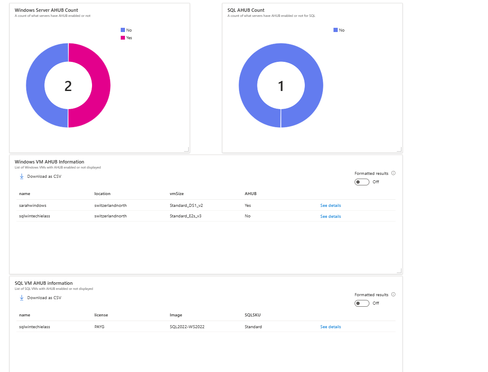

# Azure Hybrid Benefit Dashboard

This dashboard gives you a quick overview of your Windows Virtual Machine (VM) estate and VMs with SQL installed.  The important information that is quickly shows you is whether you have [Azure Hybrid Benefit](https://azure.microsoft.com/pricing/hybrid-benefit/#overview) enabled both at a Windows and SQL level.

If you'd like to see what [Azure Resource Graph](https://learn.microsoft.com/azure/governance/resource-graph/overview) queries are used to create this dashboard. You can find the Windows queries [here](/windowsahub/readme.md) and the SQL queries are [here](sqlahub/readme.md).

# How to Enable Azure Dashboard for Arc Windows/Linux
This article will show you how to use the [AHUB.json](AHUB.json) file to create a custom dashboard in the [Azure portal](https://learn.microsoft.com/azure/azure-portal/azure-portal-dashboards).

### Steps to Follow

1. Log in to [Azure Portal](https://portal.azure.com/)
2. Click on **Dashboard** from the Azure Portal menu. You may already see the dashboard view by default.

3. Click on **Create**
   

4. Select **Custom** Dashboard
   

5. You will be prompted to customise the new dashboard, click on **cancel**
   

6. Now select **Upload** and upload the [.json](Azure-Arc-Windows-Linux-Dashboard.json) file
   

7. If you want to edit the dashboard, please refer to this [link](https://learn.microsoft.com/azure/azure-portal/azure-portal-dashboards#edit-a-dashboard).

## Disclaimers
The code included in this sample is not intended to be a set of best practices on how to build scalable enterprise grade applications. This is beyond the scope of this quick start sample.
